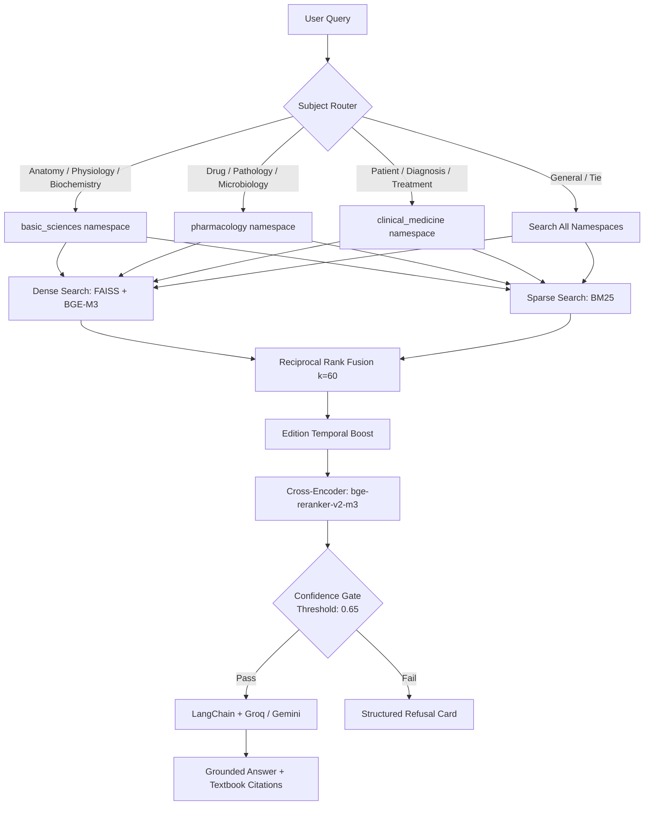

# MedRAG — Medical Textbook RAG System

MedRAG is a production-grade Retrieval-Augmented Generation system grounded in 18 authoritative medical textbooks. It answers clinical and biomedical questions with document-grounded responses from sources including Harrison's Principles of Internal Medicine, Goodman & Gilman's Pharmacology, Robbins Pathology, and Gray's Anatomy.

**Why RAG over a plain LLM?** LLMs confidently hallucinate specific drug dosages, diagnostic criteria thresholds, and anatomical relationships. MedRAG grounds every answer in actual textbook text, refuses when retrieval confidence falls below a calibrated gate, and cites the source textbook.

---

## System Architecture



---

## Dataset

**MedRAG/textbooks** (HuggingFace): 18 widely-used medical textbooks, **125,847 pre-chunked snippets**, average 182 tokens per chunk. Processed by the MedRAG paper authors using LangChain `RecursiveCharacterTextSplitter`. No custom chunking required — zero chunking risk.

Namespaces assigned by textbook title keyword matching:

| Namespace | Coverage |
|---|---|
| `basic_sciences` | Gray's Anatomy, Guyton Physiology, Biochemistry, Genetics, Histology |
| `pharmacology` | Goodman & Gilman, Katzung, Robbins Pathology, Jawetz Microbiology |
| `clinical_medicine` | Harrison's, First Aid USMLE, Surgery, Pediatrics, Psychiatry |

---

## Project Structure

```
myRAG/
├── data/
│   ├── indexes/              # FAISS and BM25 local index binary files
│   ├── eval_set.json         # Labeled 20-query USMLE-style evaluation set
│   └── eval_results.json     # Saved evaluation metrics log
├── src/
│   └── backend/
│       ├── ingestion.py      # MedRAG/textbooks HuggingFace loader + namespace mapper
│       ├── indexing.py       # FAISS dense index + BM25 sparse index setup
│       ├── retrieval.py      # Subject router, RRF, temporal weights, reranker, gate
│       ├── chain.py          # Gemini/Groq LLM integration & medical prompt constraints
│       ├── eval.py           # USMLE evaluation harness with keyword-based recall
│       ├── main.py           # FastAPI server with mock and real auth handlers
│       ├── fine_tune.py      # Embedding contrastive triplet fine-tuning script
│       └── schema.sql        # Supabase DB schema for conversation persistence
├── frontend/
│   ├── src/
│   │   ├── App.jsx           # Medical chat UI, citations, confidence meters
│   │   └── App.css           # Premium glassmorphic styling sheet
│   └── index.html            # Fonts, HTML header, and meta SEO tags
├── eval/
│   └── calibrate_threshold.py # Confidence gate F1-sweep calibration
├── tests/
│   ├── test_router.py        # Medical namespace classifier tests
│   ├── test_retrieval.py     # RRF rankings and confidence gate tests
│   └── test_integration.py   # FastAPI web clients routes tests
├── .github/
│   └── workflows/
│       └── ci.yml            # Automated pytest and evaluation pipeline
├── requirements.txt          # Backend dependencies
└── README.md                 # Project documentation
```

---

## Evaluation

**Benchmark:** USMLE-style questions (20-question hardcoded set + optional MedQA extension via `build_eval_from_medqa()`).

**Context Recall:** ground-truth keywords from the correct answer must appear in at least one retrieved chunk. More meaningful than a country-ISO proxy — directly verifies the retrieved passage covers the medically correct concept.

**RAGAS Faithfulness:** LLM answer must be grounded in retrieved context (threshold: 0.75 in CI gate).

**Confidence Calibration:** gate trained to pass medical queries, block out-of-scope queries (cooking, geography, trivia).

---

## Quick Start

```bash
# 1. Install
pip install -r requirements.txt

# 2. Configure
cp .env.template .env   # fill in GROQ_API_KEY or GEMINI_API_KEY

# 3. Download + index (batch_size=32 for RTX 2050 / 4 GB VRAM)
python -m src.backend.indexing

# 4. Backend
python -m uvicorn src.backend.main:app --reload

# 5. Frontend
cd frontend && npm install && npm run dev
```

---

## Core Engineering Solutions

### 1. Zero-Chunking Ingestion
The MedRAG dataset ships pre-chunked to ≤1000 chars by the original paper authors. Ingestion is a direct `load_dataset` call — no chunking pipeline, no heading-detection logic, no redo risk.

### 2. Dual Indexing & RRF
Medical text contains exact drug names, dosage values, and diagnostic thresholds that dense embeddings alone may miss. BM25 catches exact-match terms ("450 mg", "QTc prolongation"); dense vectors capture semantic similarity. RRF (k=60) merges both lists.

### 3. Subject Namespace Routing
Three namespaces (basic sciences / pharmacology / clinical medicine) allow subject-specific retrieval for focused queries. Ambiguous and USMLE patient-scenario queries fall back to searching all namespaces — the correct behavior for multi-domain clinical questions.

### 4. Cross-Encoder Reranking & Calibrated Gate
Top-20 candidates are reranked via `bge-reranker-v2-m3`. The top sigmoid-normalized score becomes the confidence. Below 0.65 (calibrated on the USMLE eval set vs non-medical out-of-scope queries), the system refuses — preventing hallucinated drug dosages from reaching the user.

### 5. Contrastive Embedding Fine-Tuning
Base BGE-M3 may not distinguish between similar drug mechanisms or anatomical terms. `fine_tune.py` constructs triplets (query, correct textbook passage, semantically similar but incorrect passage as hard negative) and trains with MultipleNegativesRankingLoss.
