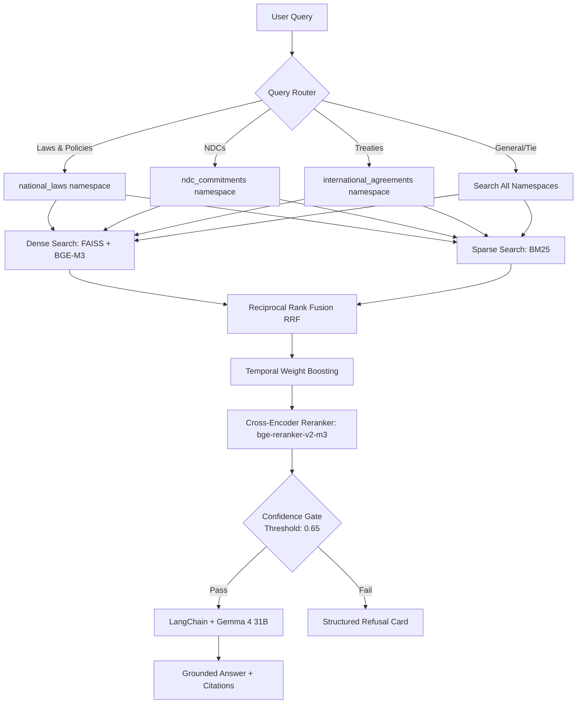

# ClimateRAG — G20 Climate Commitments Analyst

ClimateRAG is a production-grade Retrieval-Augmented Generation (RAG) system that answers questions about what the world's 20 largest economies (responsible for ~80% of global emissions) have legally committed to on climate change. Every answer is grounded in official, indexed national legislation, NDC submissions, and international agreements.

---

## 🏛️ System Architecture

The following diagram illustrates the ClimateRAG multi-stage retrieval pipeline:



---

## 📂 Project Structure

```
myRAG/
├── data/
│   ├── raw/                  # Streamed dataset cache
│   ├── indexes/              # FAISS and BM25 local index binary files
│   ├── eval_set.json         # Labeled 60-query evaluation set
│   └── eval_results.json     # Saved evaluation metrics log
├── src/
│   ├── backend/
│   │   ├── ingestion.py      # G20 filters and semantic grouping boundary chunking
│   │   ├── indexing.py       # FAISS dense index + BM25 sparse index setup
│   │   ├── retrieval.py      # Intent router, RRF, temporal weights, reranker, gate
│   │   ├── chain.py          # Gemini Gemma 4 model integration & prompt constraints
│   │   ├── main.py           # FastAPI server with mock and real auth handlers
│   │   └── fine_tune.py      # Embedding contrastive triplet fine-tuning script
│   └── frontend/
│       ├── src/
│       │   ├── App.jsx       # Chat window, warning banners, citations, meters
│       │   └── App.css       # Premium glassmorphic styling sheet
│       └── index.html        # Fonts, HTML header, and meta SEO tags
├── tests/
│   ├── test_router.py        # Keyword namespace classifier tests
│   ├── test_retrieval.py     # RRF rankings and confidence gate tests
│   └── test_integration.py   # FastAPI web clients routes tests
├── .github/
│   └── workflows/
│       └── ci.yml            # Automated pytest and evaluation pipeline
├── requirements.txt          # Backend dependencies
└── README.md                 # Project documentation
```

---

## 🚀 Quick Start Guide

### 1. Environment Setup

Clone the repository and install the backend requirements:
```bash
# Install Python packages
pip install -r requirements.txt
```

Create a `.env` file in the project root:
```env
GEMINI_API_KEY=your_google_ai_studio_api_key_here
HF_TOKEN=your_huggingface_token_here
FIREBASE_CREDENTIALS_PATH=path_to_firebase_service_account_json_if_using
MOCK_AUTH=true # Bypasses live Firebase check for local testing
CONFIDENCE_THRESHOLD=0.65
```

### 2. Stream Data and Build Indexes

Run the ingestion and index compilation script:
```bash
# Run step-by-step pipeline index generation
python -m src.backend.indexing
```

### 3. Run FastAPI Backend Server

Launch the Uvicorn web gateway:
```bash
# Starts server at http://localhost:8000
python -m uvicorn src.backend.main:app --reload
```

### 4. Setup and Run React Frontend

Navigate to the frontend folder, install packages, and start Vite development server:
```bash
cd frontend
npm install
npm run dev
```

---

## 🔍 Core Engineering Solutions

### 1. Semantic Chunk Grouping
Standard chunking chops text indiscriminately. ClimateRAG groups text blocks sequentially, detecting headers (short strings, all-caps or title-case) to trigger context flushes. This maintains logical paragraph bounds and improves context recall.

### 2. Dual Indexing & RRF
Official climate policy text contains exact phrases (e.g., "Paris Agreement Article 6", specific reduction figures like "45%"). We merge dense embeddings (capturing meaning) and BM25 keywords (matching figures) using Reciprocal Rank Fusion ($k=60$).

### 3. Temporal Boosting
To ensure updated target pledges are retrieved over stale baselines, RRF scores are adjusted by a year boost:
$$\text{Score} = \text{RRF\_Score} + 0.1 \times \frac{\text{pub\_year} - 1990}{2026 - 1990}$$

### 4. Cross-Encoder Reranking & Calibrated Gate
Top 20 candidates undergo cross-encoder processing via `BAAI/bge-reranker-v2-m3` to obtain precise score matches. The top relevance score determines the confidence. If this score is $< 0.65$ (calibrated via F1 sweep on the 60-query validation set), the system refuses to avoid hallucinations.

### 5. Triplets Embedding Fine-Tuning
Base BGE-M3 struggles with temporal versioning (e.g., 2015 NDC vs 2022 updated NDC). The `src/backend/fine_tune.py` script constructs contrastive triplet sets (`query`, `positive target`, `older year target` as hard negative) and runs contrastive training using MultipleNegativesRankingLoss.
